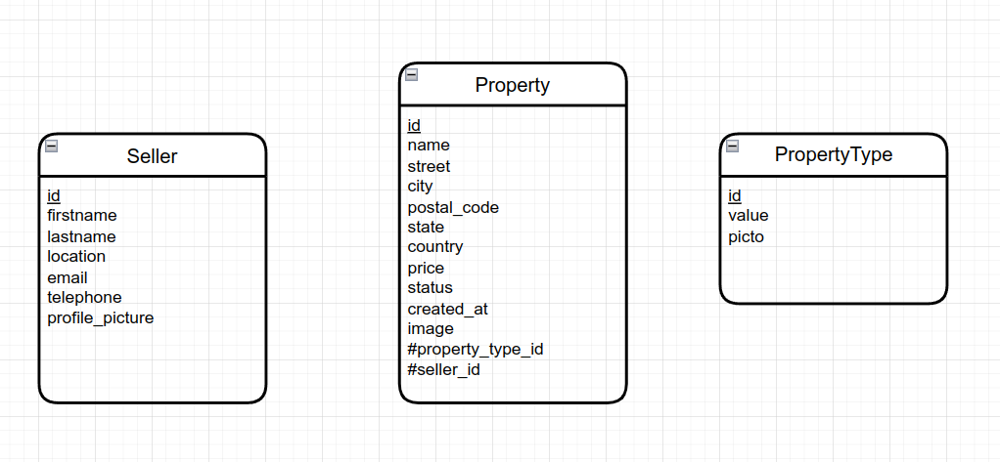

# RentUp ! PHP

Executer le site :

`npm install`

`npm run build`

## Consignes de réalisation pour dynamiser le site en PHP

1 – Découper le site (header, footer…)

2 – Créer la base de données

3 – Rendre dynamique le bloc des types de propriété (Property Types)

4 – Rendre dynamique le bloc des propriétés récentes (les 3 dernières)

5 – Rendre l’affichage du bloc des agents dynamique (afficher le nombre de propriétés par agent)

6 – Formulaire de création / modification de propriétés

7 - Page avec la liste de toutes les propriétés (et le vendeur associé)

Une propriété a 3 status possibles : A louer, A vendre, Vendue.
On affiche sur la page d'accueil uniquement les 3 biens les plus récents
On affiche uniquement les bien à louer ou à vendre sur la page d'accueil en excluant les propriétés vendues ou louées.

## Bonus

8 - La création / modification de propriétés doit être réservée aux utilisateurs connectés (donc ajouter une page de connexion et table utilisateurs)

9 - Créer un formulaire de création de vendeurs

## Tips :
Le texte peut être généré avec https://fr.lipsum.com/

Les images peuvent être générées avec https://picsum.photos/

## MLD tu projet :

# Date limite de rendu : 29 avril 2022 à 23h59

